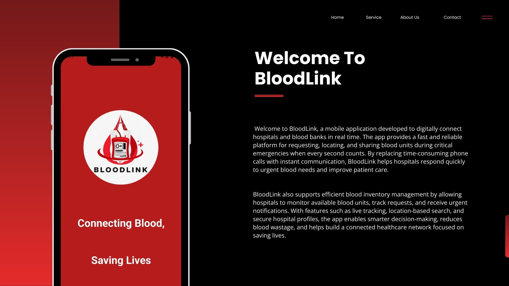
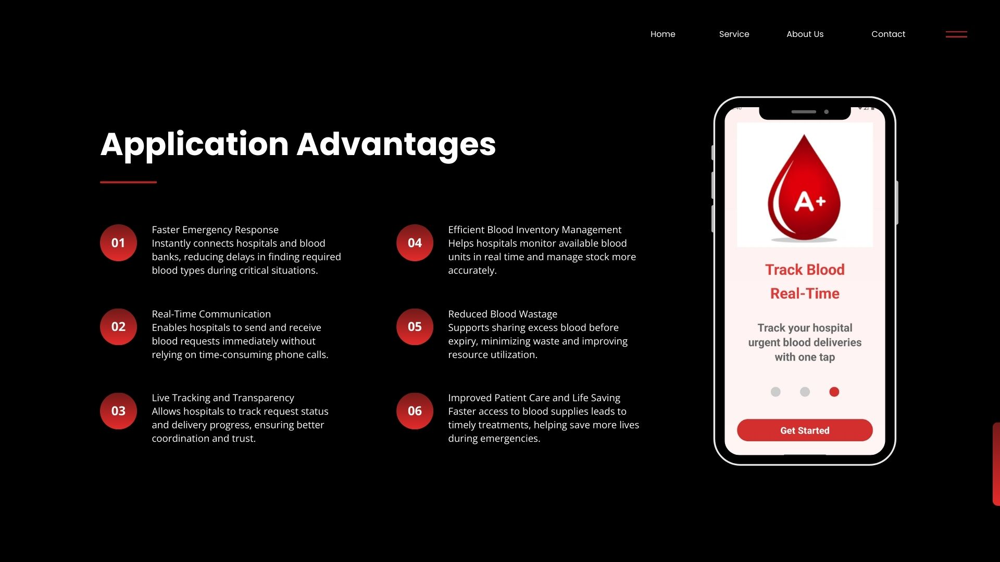
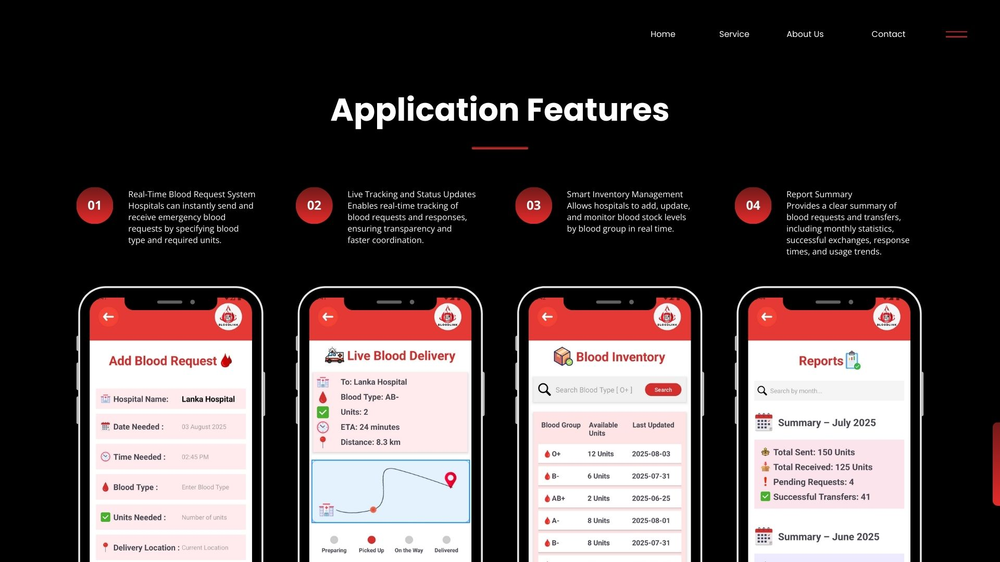
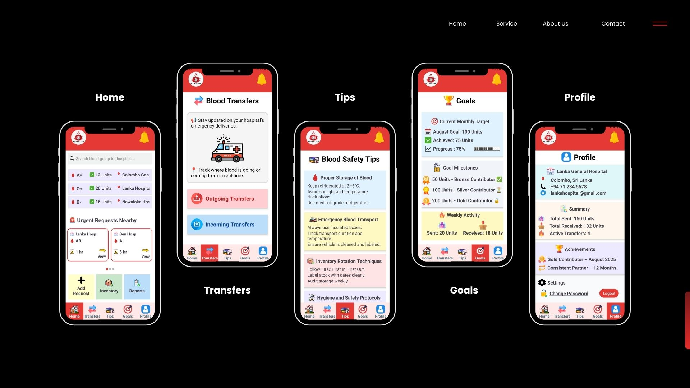
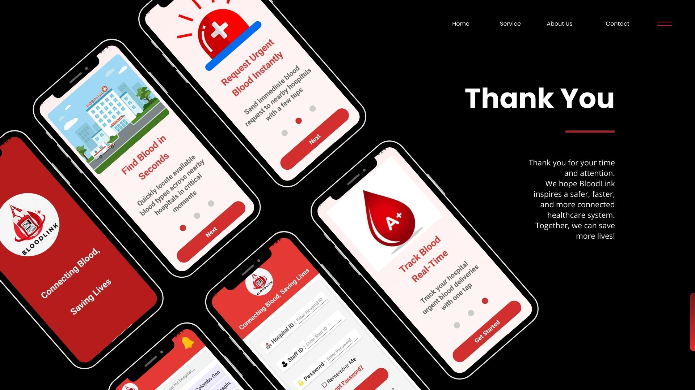

# 🩸 **BloodLink – Connecting Blood, Saving Lives**

BloodLink is a mobile application designed to digitally connect **hospitals and blood banks in real time** to help locate, request, and share blood supplies during emergency situations. When time is critical and blood availability is limited, BloodLink enables faster communication, smarter coordination, and life-saving decisions through one centralized platform.

This project was designed using **Figma** and developed using **Android Studio with Kotlin**, focusing on a clean user interface, smooth navigation, and interactive user experience.

---

## 🖼️ **App Design Overview**

> Below are some images showcasing the BloodLink application:

  &nbsp;&nbsp;&nbsp;
  &nbsp;&nbsp;&nbsp;
  

  &nbsp;&nbsp;&nbsp;
  &nbsp;&nbsp;&nbsp;
  

---

## 🎯 **Purpose of the Application**

BloodLink was created to solve real-world problems faced by hospitals during medical emergencies where **blood availability and time are critical factors**.

- Digitally connect hospitals and blood banks in real time  
- Provide a fast platform for emergency blood requests  
- Enable tracking of requests and responses  
- Support faster and informed decision-making during emergencies  

---

## 👥 **Target Users**

- Hospital blood banks  
- Medical staff responsible for managing blood stock  
- Emergency response teams handling urgent blood needs  

---

## ⭐ **Key Features**

- 🩸 **Real-Time Blood Request System**  
  Instantly send emergency blood requests by specifying blood group and required units.

- 📍 **Live Tracking & Status Updates**  
  Track request progress and hospital responses in real time.

- 📦 **Inventory Management (UI-based)**  
  Add, update, and monitor available blood units by blood type.

- 📊 **Request History & Reports**  
  View past requests, responses, monthly summaries, and transfer statistics.

- 🚨 **Urgent Notifications**  
  Receive immediate alerts for nearby blood emergencies.

- 🏥 **Hospital Profile & Achievements**  
  View hospital credibility, responsiveness, and successful donation statistics.

- 🧭 **Location-Based Smart Search**  
  Quickly find nearby hospitals with the required blood group.

- 📘 **Tips & Guidelines**  
  Information for safe blood storage and transfer practices.

---

## ✅ **Benefits of BloodLink**

- Saves critical time during emergencies  
- Improves communication between hospitals  
- Helps save more lives through faster blood access  
- Reduces blood wastage by sharing excess blood  
- Easy to use for multiple hospital staff members  
- Supports a connected and reliable healthcare network  

---

## 🛠️ **Technologies & Tools Used**

- 🎨 **Figma** – UI/UX design & prototype  
- 📱 **Android Studio** – App development  
- 💻 **Kotlin** – Programming language  
- 🧩 **XML Layouts** – User interface design  
- 🧭 **Android Views & Navigation** – Interactivity and smooth user experience  

> ❗ Note: This project does **not use a database** and focuses on UI design, interactivity, and system flow.

---

## 🌍 **Problem Solved in the Modern World**

In emergency medical situations, hospitals often face delays due to **lack of blood availability and slow communication** between institutions. BloodLink addresses this issue by providing a **centralized, real-time communication platform**, reducing response time and improving emergency preparedness in modern healthcare systems.

---

## 🎥 **Demo Video**

▶️ **Watch the BloodLink demo video:**  
[Click here to watch the demo](https://drive.google.com/file/d/1vD4qv7C8rv-ibmjOWvBcEBV1jC4z1DSY/view?usp=sharing)

---

## 🎨 **Figma Prototype Design**

🔗 **View the Figma UI/UX Design:**  
https://www.figma.com/design/ea6zWQ5AceqWW7dve7WdIc/Untitled?node-id=1-3&t=F4ip3DQB8bEN7gWI-1

---

### 🙏 **Thank You for Exploring BloodLink**
Together, let’s build technology that saves lives ❤️
